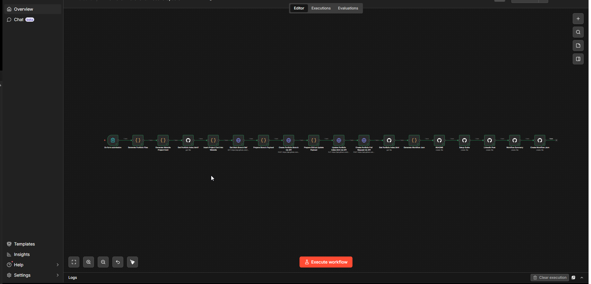

# # AI Portfolio Publisher & Website Updater v2

## Overview

This project is an n8n workflow automation built to solve a practical career and portfolio problem.
## Workflow Architecture

## Current Version

**Version:** v2  
**Name:** AI Portfolio Publisher & Website Updater

This version extends the original Portfolio Publisher workflow by adding portfolio website update automation and GitHub pull request creation.

## Problem Solved

Managing portfolio projects manually can become repetitive and inconsistent. Every new automation project needs a README, setup guide, workflow summary, LinkedIn post draft, and workflow export. Doing this manually takes time and often leads to incomplete documentation. This workflow solves that by automatically generating structured portfolio files and pushing them into GitHub.

## Tools Used

n8n, GitHub API, JavaScript, Markdown, Workflow JSON

## Workflow Steps

n8n Form collects project details → Code node processes the input → Documentation files are generated dynamically → GitHub nodes create project files in the repository → Workflow JSON is added for import and reuse → LinkedIn post draft is generated for public sharing.

## Key Features

- Captures project details through n8n
- Generates README, setup guide, workflow summary, and LinkedIn post draft
- Exports the workflow JSON for reuse
- Creates structured project folders in GitHub
- Reads the portfolio website `index.html`
- Inserts a new project card into the System Case Files section
- Creates a new GitHub branch
- Updates website code through GitHub API
- Creates a pull request for review before merging
  
## Key Learning

I learned how to design a reusable automation pipeline that accepts structured input, transforms it into multiple documentation assets, and publishes those files to GitHub automatically. This project helped me understand n8n triggers, form inputs, Code node logic, GitHub API integration, dynamic expressions, and portfolio-focused automation design.

## Files Included

- README.md
- setup-guide.md
- linkedin-post.md
- workflow-summary.md

## Project Status

Completed basic documentation generation workflow.

## Date Created

2026-04-28
